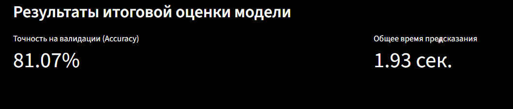

<div align="center">


🦋 Классификация видов бабочек 🦋

Интерактивное веб-приложение на Streamlit для классификации изображений с использованием сверточной нейронной сети (CNN), обученной на TensorFlow/Keras.

<p>


</p>

</div>

📜 Оглавление

🦋 О проекте

🎯 Задача

🛠️ Технологии и инструменты

🌌 Этапы работы

1. Подготовка данных

2. Обучение модели

3. Оптимизация и конвертация

📈 Результаты и оценка

✨ Демонстрация

🚀 Как запустить

🦋 О проекте

Этот проект является практической реализацией Лабораторной работы №3 по теме "Определение вида бабочки по изображению". Задача заключается в построении и обучении сверточной нейронной сети (CNN) для классификации 75 различных видов бабочек.

Решение представлено в виде интерактивного веб-приложения на Streamlit. Приложение позволяет не только ознакомиться с результатами обучения модели, но и классифицировать собственные изображения бабочек в реальном времени, используя легкую и оптимизированную TFLite-модель.

<br>
<p align="center">

</p>
<br>

🎯 Задача

Основная цель — разработать и оценить модель глубокого обучения для классификации изображений бабочек. Исходная задача описана в lab3.ipynb.

Ключевые метрики для оценки качества модели:

Accuracy Score — точность предсказаний на валидационном наборе данных.

Общее время предсказания — суммарное время, которое требуется модели для обработки всех изображений из валидационного набора.

🛠️ Технологии и инструменты
Категория	Инструмент
Глубокое обучение	TensorFlow, Keras
Анализ данных	NumPy, Scikit-learn
Веб-приложение	Streamlit
Оптимизация	TensorFlow Lite (TFLite)
Обработка изображений	Pillow, OpenCV
🌌 Этапы работы
1. Подготовка данных (prepare_data.py)

🗂️ Реструктуризация директорий. Исходный датасет представлен в виде "плоских" папок train и test, где все изображения лежат вперемешку. Скрипт prepare_data.py автоматически анализирует имена файлов (например, ADONIS (1).jpg), создает папки для каждого класса (вида бабочки) и копирует туда соответствующие изображения. Это необходимо для корректной работы генераторов данных Keras (ImageDataGenerator).

2. Обучение модели (train_butterfly.py)

🧠 Аугментация и архитектура. Для искусственного расширения обучающего набора данных и повышения устойчивости модели используется ImageDataGenerator с различными техниками аугментации (повороты, масштабирование, сдвиги). Архитектура CNN состоит из последовательных сверточных слоев (Conv2D), слоев субдискретизации (MaxPool2D) и регуляризации (Dropout), а также полносвязных слоев (Dense) для финальной классификации.
```
# train_butterfly.py
model = Sequential([
    Conv2D(32, (3,3), activation='relu', input_shape=(height, width, channels)),
    # ... другие слои ...
    MaxPool2D((2, 2)),
    Dropout(0.25),
    Flatten(),
    Dense(512, activation='relu'),
    Dropout(0.5),
    Dense(num_classes, activation='softmax')
])
```
Модель обучается с использованием коллбэков, таких как EarlyStopping (для предотвращения переобучения) и ModelCheckpoint (для сохранения лучшей версии модели).

3. Оптимизация и конвертация (convert_to_tflite.py)

⚡ TFLite для скорости. После обучения лучшая модель (butterfly_model.h5) конвертируется в формат TensorFlow Lite (butterfly_model_quant.tflite). В процессе конвертации применяется квантование весов, что значительно уменьшает размер модели и ускоряет время предсказания, делая её идеальной для встраивания в веб-приложения.

📈 Результаты и оценка

Приложение наглядно демонстрирует итоговые метрики качества, полученные на валидационной выборке. Это позволяет быстро оценить эффективность обученной модели.

<p align="center">

<i><br>Интерфейс для просмотра итоговых метрик: точность (Accuracy) и общее время предсказания.</i>
</p>

✨ Демонстрация

Ключевая особенность приложения — раздел "Предсказание", где пользователь может загрузить собственное изображение бабочки. Приложение обработает его и мгновенно выведет результат: название предсказанного вида, уверенность модели и время, затраченное на анализ.

<div align="center">

<p><i><br>Интерактивный интерфейс для загрузки и классификации изображения бабочки.</i></p>
</div>

🚀 Как запустить

1. Клонируйте репозиторий:```bash
git clone [URL вашего репозитория]
cd [название папки репозитория]
```
**2. Установите зависимости:**
```bash
pip install -r requirements.txt
```
(Предполагается, что у вас есть файл requirements.txt с библиотеками tensorflow, streamlit, scikit-learn, numpy, pillow)

3. Подготовьте данные:
Загрузите датасет (train.zip, valid.zip), распакуйте его и запустите скрипт для реструктуризации папок.


4. Обучите модель:
Этот шаг может занять продолжительное время в зависимости от мощности вашего компьютера.
```
python train_butterfly.py
```
В результате будут созданы файлы butterfly_model.h5 и evaluation_results.json.

5. Конвертируйте модель в TFLite:
```
python convert_to_tflite.py
```
6. Запустите веб-приложение:
```
streamlit run lab3_streamlit.py
```
Откройте браузер и перейдите по локальному адресу, который отобразится в терминале.